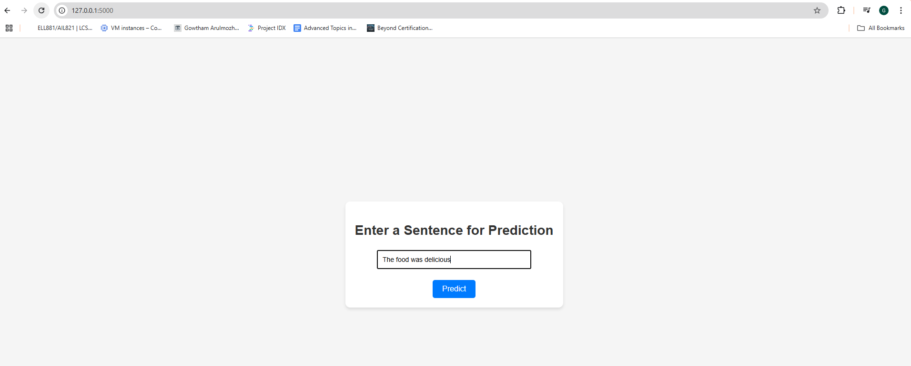
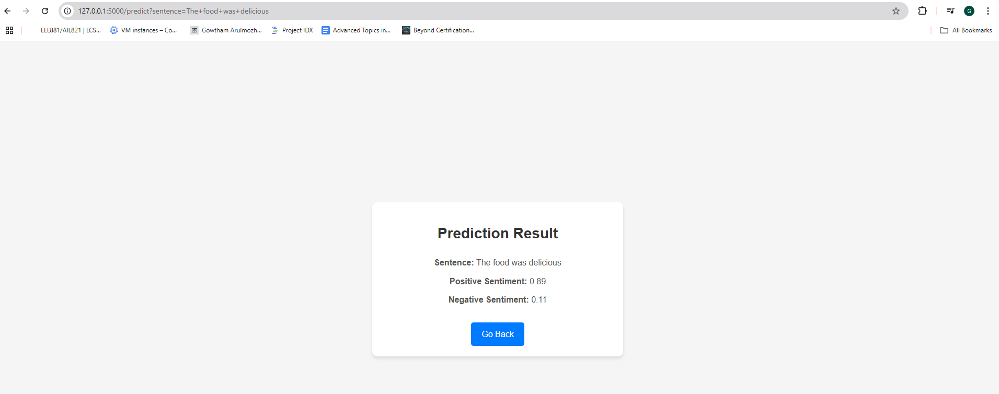

# Sentiment Analysis Using BERT  

This repository contains a sentiment analysis project where a fine-tuned **BERT model** is used to classify text data into positive or negative sentiments. The model has been deployed as a Flask web application for real-time predictions. This architecture achieved an accuracy of 90.3 percentile.  

## Table of Contents  

- [Introduction](#introduction)  
- [Features](#features)  
- [Dataset](#dataset)  
- [Installation](#installation)  
- [Usage](#usage)
- [Sample Predictions](#sample-predictions)  
- [Future Work](#future-work)  

---

## Introduction  

Sentiment analysis is a key natural language processing (NLP) task that helps in understanding emotions conveyed in text data. In this project, I have *fine-tuned a BERT model* to achieve high accuracy in sentiment prediction. The model is served using a Flask backend and can process real-time user inputs via a simple web interface.  

---

## Features  

- **Real-Time Sentiment Prediction**: Enter a sentence and instantly receive the sentiment score.  
- **Flask Deployment**: A lightweight and easy-to-deploy backend framework.  
- **Interactive Web Interface**: Built for ease of use, allowing users to input text and view predictions directly in the browser.  

---

## Dataset  

The project supports any labeled dataset with columns for `text` and `label`. We can make use of any datasets mentioned below on this model:  
- IMDb Reviews  
- Twitter Sentiment140  
- Custom datasets  

Ensure the dataset is in a `.csv` or `.tsv` format before training and try to do changes in the data format and entities.  

---

## Installation  

1. Clone this repository:  
   ```bash  
   git clone https://github.com/your-username/sentiment-analysis-bert-flask.git  
   cd sentiment-analysis-bert-flask  
   ```  

2. Create and activate a virtual environment or install miniconda (https://docs.anaconda.com/miniconda/install/) and create a conda environment and install the dependencies:  
   ```bash  
   python3 -m venv env  
   source env/bin/activate  # For Linux/MacOS  
   .\env\Scripts\activate  # For Windows  
   ```
   ```bash
   conda init
   conda create -n <name> python==<version>
   conda activate <name>
   ```

3. Install dependencies:  
   ```bash  
   pip install -r requirements.txt  
   ```  

4. Download a pre-trained BERT model for finetuning from huggingface, you can choose whichever model you want to try. But I used **bert-base-uncased** from huggingface to finetune the model. 

---

## Usage  

1. **Prepare Dataset**: Place your dataset in the `data/` folder. And do the necessary changes in dataset and preprocess file for training phase.  
2. **Train the Model**: You can change the parameters which are mentioned in config file however you want.Run the script to fine-tune the BERT model:  
   ```bash  
   python train.py  
   ```  
3. **Start Flask App**: After training the model. Model file *model.bin* will be generated in the default folder path. Next, Launch the web application:  
   ```bash  
   python app.py  
   ```  
   The app will run locally at `http://127.0.0.1:5000`.  

4. **Access the Web Interface**: Open your browser and input text for prediction.  

---

## Sample Predictions 

### Input Screen  
  

### Output Screen  
  

---

## Future Work  

- To Enhance this web application into a fully functional **end-to-end pipeline** for production use, including deployment on cloud platforms, monitoring, and scalability improvements.  

---
